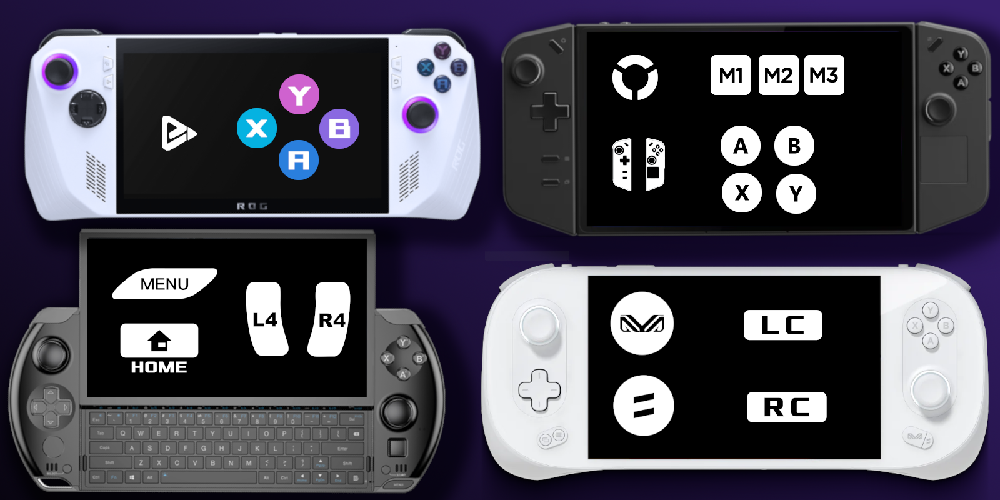

# Handheld Controller Glyphs

A theme that changes the default controller glyphs to ones that match the handheld.
Meant to be used with [HHD](https://github.com/hhd-dev/hhd) or [InputPlumber](https://github.com/ShadowBlip/InputPlumber).

## Supported Themes

 - Anbernic
   - Win600
 - AOKZOE
   - A1
 - ASUS
   - ROG Ally
   - ROG Xbox Ally
 - AYANEO
   - Air
   - 2
   - 3
   - Kun
   - Neo
   - Next
   - Slide
 - AYN
   - Loki
 - GPD
   - Win 3
   - Win 4
   - Win Mini
   - Win Max 2
 - Lenovo
   - Legion Go
   - Legion Go S
   - Legion Go 2
 - MSI
   - Claw
 - ONEXPLAYER
   - X1
   - G1
   - 2
   - ONEXFLY F1
 - TECNO
   - Pocket Go
 - TECTOY
   - Zeenix
 - Zotac
   - Zone

## Install

Get it from the Deck Themes store:
https://deckthemes.com/themes/view?themeId=27d2dfb0-f58c-468f-81d5-f06534534133

Decky and the CSS Loader Plugin must already be installed and enabled.

## Credits

 - [honjow](https://github.com/honjow): originally forked from their [SBP-PS5-to-Handheld](https://github.com/honjow/SBP-PS5-to-Handheld) theme.
 - [frazse](https://github.com/frazse): Legion Go images originally copied from their [SBP-Legion-Go-Theme](https://github.com/frazse/SBP-Legion-Go-Theme) theme.
